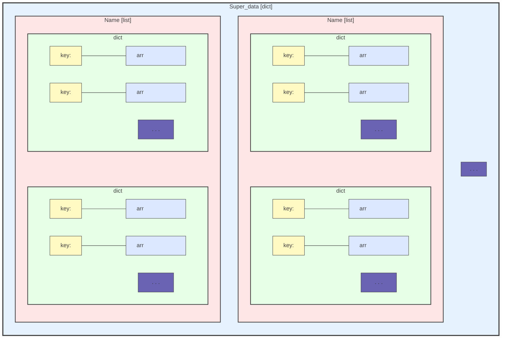

```mermaid
flowchart TB
    subgraph SG_Main["Super_data [dict]"]
        direction TB
        subgraph subdots["&nbsp;&nbsp;. . .&nbsp;&nbsp;"]
        end
        subgraph SG_Name1["Name [list]"]
            direction TB
            subgraph SG_Dict1["dict"]
                direction LR
                key1["key:"] --- arr1["arr&nbsp;&nbsp;&nbsp;&nbsp;&nbsp;&nbsp;&nbsp;&nbsp;&nbsp;&nbsp;&nbsp;&nbsp;&nbsp;&nbsp;&nbsp;&nbsp;&nbsp;&nbsp;&nbsp;&nbsp;"]
                key2["key:"] --- arr2["arr&nbsp;&nbsp;&nbsp;&nbsp;&nbsp;&nbsp;&nbsp;&nbsp;&nbsp;&nbsp;&nbsp;&nbsp;&nbsp;&nbsp;&nbsp;&nbsp;&nbsp;&nbsp;&nbsp;&nbsp;"]
                dots1["&nbsp;&nbsp;. . .&nbsp;&nbsp;"]
            end
            subgraph SG_Dict2["dict"]
                direction LR
                key3["key:"] --- arr3["arr&nbsp;&nbsp;&nbsp;&nbsp;&nbsp;&nbsp;&nbsp;&nbsp;&nbsp;&nbsp;&nbsp;&nbsp;&nbsp;&nbsp;&nbsp;&nbsp;&nbsp;&nbsp;&nbsp;&nbsp;"]
                key4["key:"] --- arr4["arr&nbsp;&nbsp;&nbsp;&nbsp;&nbsp;&nbsp;&nbsp;&nbsp;&nbsp;&nbsp;&nbsp;&nbsp;&nbsp;&nbsp;&nbsp;&nbsp;&nbsp;&nbsp;&nbsp;&nbsp;"]
                dots2["&nbsp;&nbsp;. . .&nbsp;&nbsp;"]
            end

            SG_Dict1 ~~~ SG_Dict2
        end
        subgraph SG_Name2["Name [list]"]
            direction TB
            subgraph SG_Dict3["dict"]
                direction LR
                key5["key:"] --- arr5["arr&nbsp;&nbsp;&nbsp;&nbsp;&nbsp;&nbsp;&nbsp;&nbsp;&nbsp;&nbsp;&nbsp;&nbsp;&nbsp;&nbsp;&nbsp;&nbsp;&nbsp;&nbsp;&nbsp;&nbsp;"]
                key6["key:"] --- arr6["arr&nbsp;&nbsp;&nbsp;&nbsp;&nbsp;&nbsp;&nbsp;&nbsp;&nbsp;&nbsp;&nbsp;&nbsp;&nbsp;&nbsp;&nbsp;&nbsp;&nbsp;&nbsp;&nbsp;&nbsp;"]
                dots3["&nbsp;&nbsp;. . .&nbsp;&nbsp;"]
            end
            subgraph SG_Dict4["dict"]
                direction LR
                key7["key:"] --- arr7["arr&nbsp;&nbsp;&nbsp;&nbsp;&nbsp;&nbsp;&nbsp;&nbsp;&nbsp;&nbsp;&nbsp;&nbsp;&nbsp;&nbsp;&nbsp;&nbsp;&nbsp;&nbsp;&nbsp;&nbsp;"]
                key8["key:"] --- arr8["arr&nbsp;&nbsp;&nbsp;&nbsp;&nbsp;&nbsp;&nbsp;&nbsp;&nbsp;&nbsp;&nbsp;&nbsp;&nbsp;&nbsp;&nbsp;&nbsp;&nbsp;&nbsp;&nbsp;&nbsp;"]
                dots4["&nbsp;&nbsp;. . .&nbsp;&nbsp;"]
            end

            SG_Dict3 ~~~ SG_Dict4
        end

    end

    style SG_Main  fill:#e6f3ff,stroke:#404040,stroke-width:3px,color:#404040
    style SG_Name1 fill:#ffe6e6,stroke:#404040,stroke-width:2px,color:#404040
    style SG_Name2 fill:#ffe6e6,stroke:#404040,stroke-width:2px,color:#404040
    style SG_Dict1 fill:#e6ffe6,stroke:#404040,stroke-width:2px,color:#404040
    style SG_Dict2 fill:#e6ffe6,stroke:#404040,stroke-width:2px,color:#404040
    style SG_Dict3 fill:#e6ffe6,stroke:#404040,stroke-width:2px,color:#404040
    style SG_Dict4 fill:#e6ffe6,stroke:#404040,stroke-width:2px,color:#404040
    style key1 fill:#fff9c4,stroke:#404040,color:#404040
    style key2 fill:#fff9c4,stroke:#404040,color:#404040
    style key3 fill:#fff9c4,stroke:#404040,color:#404040
    style key4 fill:#fff9c4,stroke:#404040,color:#404040
    style key5 fill:#fff9c4,stroke:#404040,color:#404040
    style key6 fill:#fff9c4,stroke:#404040,color:#404040
    style key7 fill:#fff9c4,stroke:#404040,color:#404040
    style key8 fill:#fff9c4,stroke:#404040,color:#404040
    style arr1 fill:#dce8ff,stroke:#404040,color:#404040
    style arr2 fill:#dce8ff,stroke:#404040,color:#404040
    style arr3 fill:#dce8ff,stroke:#404040,color:#404040
    style arr4 fill:#dce8ff,stroke:#404040,color:#404040
    style arr5 fill:#dce8ff,stroke:#404040,color:#404040
    style arr6 fill:#dce8ff,stroke:#404040,color:#404040
    style arr7 fill:#dce8ff,stroke:#404040,color:#404040
    style arr8 fill:#dce8ff,stroke:#404040,color:#404040
    style dots1 fill:#6A62B3,stroke:#404040
    style dots2 fill:#6A62B3,stroke:#404040
    style dots3 fill:#6A62B3,stroke:#404040
    style dots4 fill:#6A62B3,stroke:#404040
    style subdots fill:#6A62B3,stroke:#404040
```